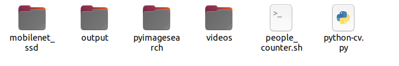

# Open_CV_People-counter

<h1>About Project :</h1>

Open CV is Computer vision library for real time computer vision using ML and AI. Our task was to analyze how to use it as a system that can track the people going in and out from one room by using some sort of unique ID. We Just use the trained model from andrianpyimgaesearch [https://www.pyimagesearch.com/]. 

<h1>Creating Virtual enviroment to avoid any error.</h1>

 ```bash
#Installation
python3 -m pip install --user virtualenv
#then create virtual env 
python3 -m venv env
#then activate the virtual enviroment
source env/bin/activate
#If wanna deactivate just type
deactiavte
```
<h1>Dependencies to run this project.</h1>

 ```bash
#1-Scipy,Numpy
pip3 install numpy
pip3 install scipy
#2-imutils
pip3 install imutils
#3-OpenCv
pip3 install opencv-python
#4-Dlib
pip3 install dlib
```
<h1>Create A folder with any name.</h1>
Then after downloading all the files extract them and keep all the files like that in the folder given below example


<h1>After Downloading the (people_counter.sh) file open it change the directory path after word source accordinly.</h1>


<h1>Create videos folder with name (videos) case sensetive and output with name output case sensetive.</h1>
<p>Then videos.txt file is given just go to it and downloads and test through the videos or you can input any video in videos folders make sure the name is with .mp4 format.</p>
 
 <h1>Activating the enviroment and running the project.</h1>
 
 
```bash
 #Method-1
 #Activate the enviroment
 source env/bin/activate
 #then using cd command go to the folder where all your files are and then type
python3 python-cv.py --prototxt mobilenet_ssd/MobileNetSSD_deploy.prototxt --model mobilenet_ssd/MobileNetSSD_deploy.caffemodel --input videos/example_01.mp4 --output output/output_01.avi
 #Method-2
 #or else using cd go to then type
 ./people_counter.sh 
 #this will do all the things but make sure to change bash script path accordingly told previously above in the readme.
 #then after running deactivate it through
 deactiavte
```
<h1>Some output Example : </h1>


<h1>License : </h1>

[](https://opensource.org/licenses/MIT)

<p>Alert! All things are tested on Ubuntu-Linux.</p>
